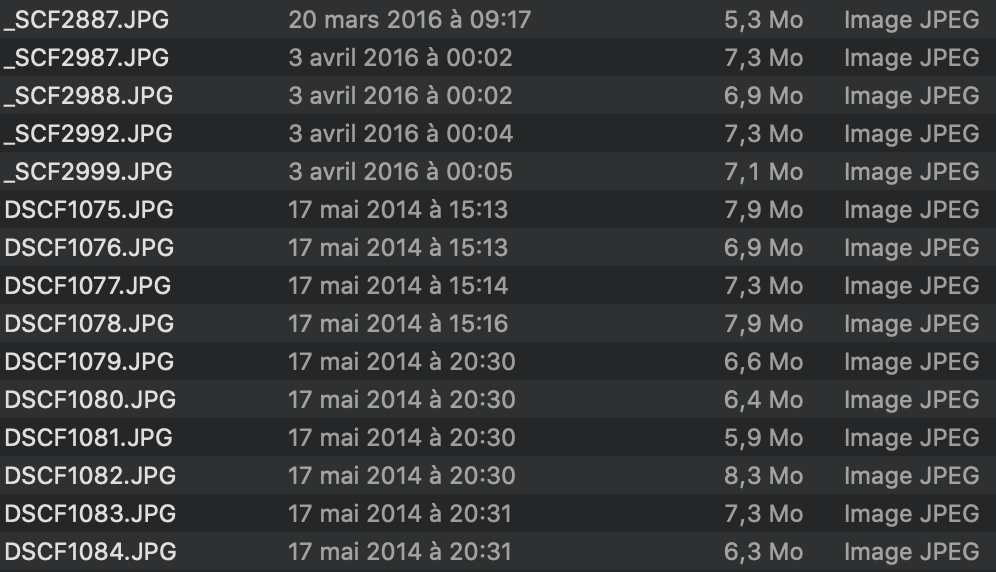
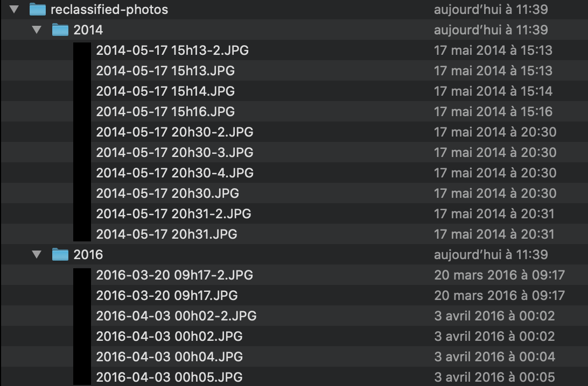

Fold-it
======= 

Written in PHP, this application gives you several commands to make your folder better organized.

**Installation**

You need to install: 
- PHP 7.1 +
- Composer

Install dependencies:

```bash
composer install
```

**Available commands:**

Rename your files from their date of creation in order to have your folders more organized:

```shell
php app.php fold:rename-by-date input-directory output-directory
```

You can precise the timezone with option -t "Europe/Berlin".


*Example of use:*

- A folder named `photos` in the project directory contains:



- Execute the program: `php app.php fold:rename-by-date photos reclassified-photos`

- A new folder will be created:



**TODO:**

- Add unit tests
